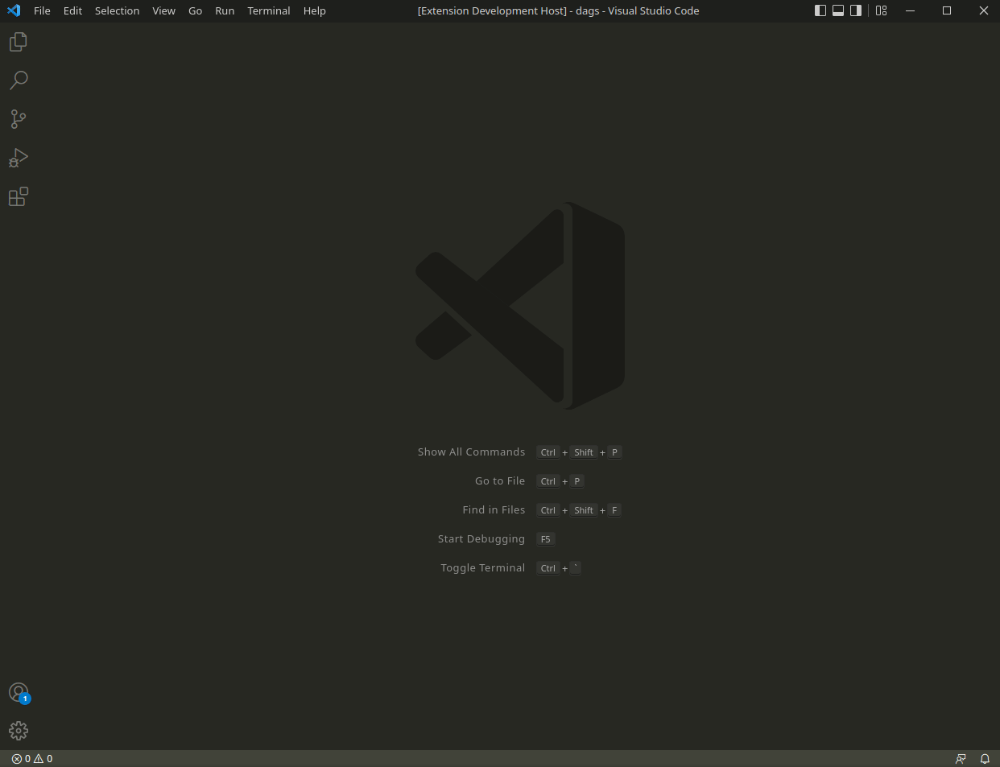
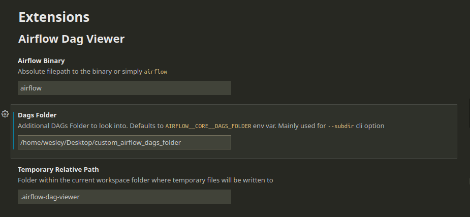

# 🚀 Airflow DAG Viewer

Speed up your DAG authoring flow by quickly visualizing the Graph View of your Airflow DAGs within VS Code

## 🚦 Requirements

1. Install and setup `apache-airflow`
2. Listing dags from command line must be working - `airflow dags list`
3. Install graphviz - *[overview](https://graphviz.org) &bull; [installation page](https://graphviz.org/download/)*

## 🛠️ Extension Settings

Some level of customization is also provided. These are the available settings:

- You may specify a different `airflow` binary than the default from your global environment
- You may provide an additional DAGs Folder to look into
- You may change the temporary folder where the `.svg` files are written to
